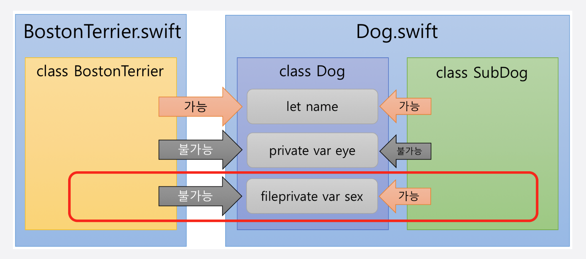

# **open, fileprivate**

- 접근한정자

- swift 3.0부터 적용

  - open : 모듈 외부에서 접근할 수 있는 가장 느슨한 접근한정자 (신규)

  - public : 모듈 외부에서 접근할 수 있지만 상속은 되지 않고 override할수 없다

  - internal : 모듈일 경우 접근이 가능하고 아무것도 쓰지 않는 경우 기본 설정되는 접근한정자이다.

  - fileprivate : 단어 그대로 파일일 경우 접근할 수 있는 접근한정자이다. (신규)

  - private: 클래스 등이 선언된 영역내에서만 접근이 가능하다.

    

- **open** vs **public**

  - open
    - 다른 모듈(import하여 사용하는 것들)에서 사용 가능
    - 상속 가능
    - 사용시 상위클래스도 open이어야 함
  - public
    - 다른 모듈(import하여 사용하는 것들)에서 사용 가능
    - 상속 불가
  - 오버라이드할 수 없고 상속되지 않게 할 경우 이전까지는 final public으로 선언하던 것으로 Swift 3.0부터는 public만 선언한다.
  - 오버라이드할 수 있고 하위클래스화할 경우 이전까지는 public으로 선언했지만 Swift 3.0부터는 open으로 선언한다.